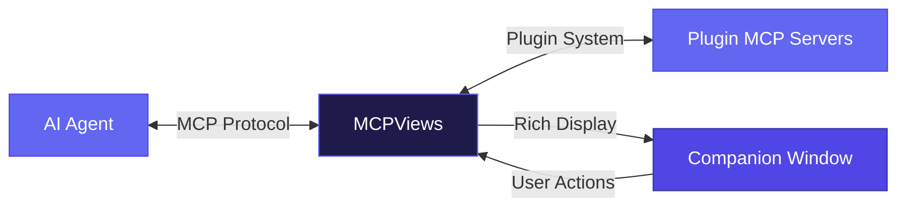

# MCPViews

MCPViews is a desktop application that gives AI agents a visual interface. Through the Model Context Protocol (MCP), agents can push rich content, interactive data, and full application UIs to a companion window — turning text-only conversations into visual, interactive workflows.

The real power is the plugin system. Each plugin pairs an MCP server with a custom renderer: the agent calls tools over MCP, and the renderer displays the results as a live, interactive UI — complete with its own API connections, state, and user interactions. A plugin can be a data governance dashboard, a code browser, a document editor, or anything else. The agent works through MCP; the user works through the UI. Both see the same data.

This blurs the line between agentic workflows and traditional applications. Instead of choosing between an AI-only flow or a manual UI, MCPViews lets both happen simultaneously — agents and humans collaborating through a shared visual layer.



## Quick Start

### 1. Install MCPViews

**macOS / Windows**: Download the latest installer from [Releases](https://github.com/DeeJanuz/mcpviews/releases) (`.dmg` for macOS, `.msi` or `.exe` for Windows).

**Linux**: See [Building from Source](#building-from-source) below.

### 2. Connect your AI agent

Add MCPViews as an MCP server in your agent's configuration. MCPViews runs a Streamable HTTP MCP server on `http://localhost:4200/mcp`.

**Claude Code** — add to your global or project `.claude/settings.json`:
```json
{
  "mcpServers": {
    "mcpviews": {
      "type": "url",
      "url": "http://localhost:4200/mcp"
    }
  }
}
```

**Claude Desktop** — add to `claude_desktop_config.json`:
```json
{
  "mcpServers": {
    "mcpviews": {
      "url": "http://localhost:4200/mcp"
    }
  }
}
```

**Cursor / Windsurf / other MCP clients** — point to `http://localhost:4200/mcp` as a Streamable HTTP MCP server.

### 3. Set up rules and skills

On your first conversation, ask your agent to call the `mcpviews_setup` tool. This returns platform-specific instructions for persisting a session-start rule so `init_session` is called automatically in every future session:

```
> Call the mcpviews_setup tool to configure MCPViews for this agent.
```

The setup tool will tell your agent how to create the appropriate rule file (e.g., `.claude/rules/mcpviews-init.md` for Claude Code) so MCPViews initializes automatically going forward.

### 4. Install plugins

Plugins extend MCPViews with tools from third-party MCP servers. Browse and install them directly through your agent:

```
> Call list_registry to see available plugins.
> Call mcpviews_install_plugin with trigger_auth: true to install and authenticate in one step.
```

Or use the **GUI**: click the system tray icon and select **Manage Plugins** to browse, install, and configure plugins visually.

Plugins that require authentication (OAuth, API key, or bearer token) will show their auth status in the `init_session` response. Use `start_plugin_auth` to authenticate individually, or pass `trigger_auth: true` when installing to handle it inline.

### 5. Build your own plugins

See the [Plugin Development Guide](docs/plugin-development.md) for a step-by-step walkthrough covering:
- Creating a plugin manifest
- Writing custom renderers
- Setting up MCP server integration and authentication
- Packaging and publishing to the registry

For the full manifest schema and auth reference, see [Plugin System Reference](docs/plugins.md).

---

## Architecture

- **Rust backend** (axum): HTTP server on `:4200` for push API + review workflow
- **WebView frontend**: Vanilla JS renderers for core content types (rich content, document preview, citations); domain-specific renderers delivered via plugins
- **Node.js sidecar**: SSE bridge for remote server connections
- **System tray**: Hide-to-tray, click to show, auto-start on login

## Building from Source

Requires Rust, Node.js 20+, and platform-specific system libraries.

**Linux prerequisites:**
```bash
# Debian/Ubuntu:
sudo apt install libwebkit2gtk-4.1-dev libappindicator3-dev librsvg2-dev patchelf

# Fedora:
sudo dnf install webkit2gtk4.1-devel libappindicator-gtk3-devel librsvg2-devel

# Arch:
sudo pacman -S webkit2gtk-4.1 libappindicator-gtk3 librsvg
```

**Build:**
```bash
git clone https://github.com/DeeJanuz/mcpviews.git
cd mcpviews
npm install
npm run build
```

## Development

```bash
# Install dependencies
npm install

# Dev mode (hot reload frontend + Rust backend)
npm run dev

# Build frontend only
npm run build:frontend

# Build Rust backend only (from src-tauri/)
cargo build

# Build full Tauri app (frontend + backend + installer)
npm run build
```

## Testing the Push API

```bash
# Health check
curl http://localhost:4200/health

# Push rich content
curl -X POST http://localhost:4200/api/push \
  -H 'Content-Type: application/json' \
  -d '{"toolName":"rich_content","result":{"data":{"title":"Test","body":"## Hello\n\nThis is a test."}}}'

# Push with review (blocks until user decides)
curl -X POST http://localhost:4200/api/push \
  -H 'Content-Type: application/json' \
  -d '{"toolName":"write_document","result":{"data":{"operations":[{"type":"replace","target":"Introduction","replacement":"New intro text"}]}},"reviewRequired":true}'
```

## SSE Sidecar

Connects to a remote app's companion stream and forwards events to the local HTTP server.

```bash
# Build
cd sidecar && bash build.sh

# Run
node sidecar/dist/sse-bridge.mjs --app-host https://app.example.com --key lf_companion_xxx
```

## Project Structure

```
mcpviews/
├── src-tauri/              # Rust backend
│   ├── src/
│   │   ├── main.rs         # Tauri entry, tray, plugin setup
│   │   ├── http_server.rs  # axum HTTP server (:4200)
│   │   ├── session.rs      # In-memory session store
│   │   ├── review.rs       # Pending review channels (oneshot)
│   │   ├── commands.rs     # Tauri IPC commands
│   │   └── state.rs        # Shared app state
│   ├── Cargo.toml
│   └── tauri.conf.json
├── src/                    # Frontend (Vite entry)
│   └── index.html          # HTML shell
├── public/                 # Static assets (copied to dist)
│   ├── main.js             # App bootstrap (Tauri IPC)
│   ├── styles.css          # All styles
│   └── renderers/          # Built-in content renderers
├── sidecar/                # Node.js SSE bridge
│   ├── sse-bridge.ts
│   └── build.sh
├── registry/               # Plugin registry
│   └── registry.json       # Default registry with available plugins
├── cli/                    # CLI plugin manager
│   └── src/main.rs
├── shared/                 # Shared types (manifest, auth, registry)
│   └── src/lib.rs
├── package.json
└── vite.config.ts
```

## Plugin System

MCPViews supports plugins that extend the app with tools from third-party MCP servers. Each plugin is a JSON manifest that declares renderer mappings, MCP server configuration, and authentication. Plugins are stored as individual JSON files in `~/.mcpviews/plugins/`.

For full documentation, see [docs/plugins.md](docs/plugins.md). For a step-by-step guide to creating your own plugin, see [docs/plugin-development.md](docs/plugin-development.md).

## Installing Plugins

### Via GUI

Open the system tray menu and select **Manage Plugins**. From there you can:

- Browse the plugin registry to discover and install available plugins
- Add a custom plugin from a local manifest file
- View installed plugins and remove them

### Via CLI

```bash
# Search the registry
mcpviews-cli plugin search

# Install a plugin from the registry
mcpviews-cli plugin add ludflow

# List installed plugins
mcpviews-cli plugin list

# Install from a local manifest file
mcpviews-cli plugin add-custom ./my-plugin.json

# Remove a plugin
mcpviews-cli plugin remove ludflow
```

For full CLI documentation, see [docs/cli.md](docs/cli.md).

## Plugin Manifest Format

A plugin manifest is a JSON file with renderer mappings and MCP configuration:

```json
{
  "name": "my-plugin",
  "version": "1.0.0",
  "renderers": {
    "tool_name": "renderer_name"
  },
  "mcp": {
    "url": "http://localhost:8080/mcp",
    "auth": {
      "type": "bearer",
      "token_env": "MY_API_KEY"
    },
    "tool_prefix": "myplugin_"
  }
}
```

| Field | Description |
|-------|-------------|
| `name` | Unique plugin identifier |
| `version` | Semantic version |
| `renderers` | Maps MCP tool names to frontend renderers |
| `mcp.url` | MCP server endpoint |
| `mcp.auth` | Authentication config (`bearer`, `api_key`, or `oauth`) |
| `mcp.tool_prefix` | Prefix for tool names to avoid collisions |

Three auth types are supported: **bearer token** (env var), **API key** (custom header + env var), and **OAuth** (browser redirect flow). See [docs/plugins.md](docs/plugins.md) for the full schema reference.

## CLI Reference

| Command | Description |
|---------|-------------|
| `mcpviews-cli plugin list` | List installed plugins |
| `mcpviews-cli plugin add <name>` | Install a plugin from the registry |
| `mcpviews-cli plugin remove <name>` | Remove an installed plugin |
| `mcpviews-cli plugin add-custom <path>` | Install from a local manifest file |
| `mcpviews-cli plugin search [query]` | Search the plugin registry |

See [docs/cli.md](docs/cli.md) for full usage examples and configuration.
