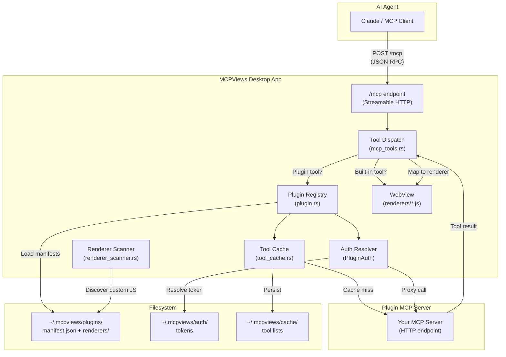
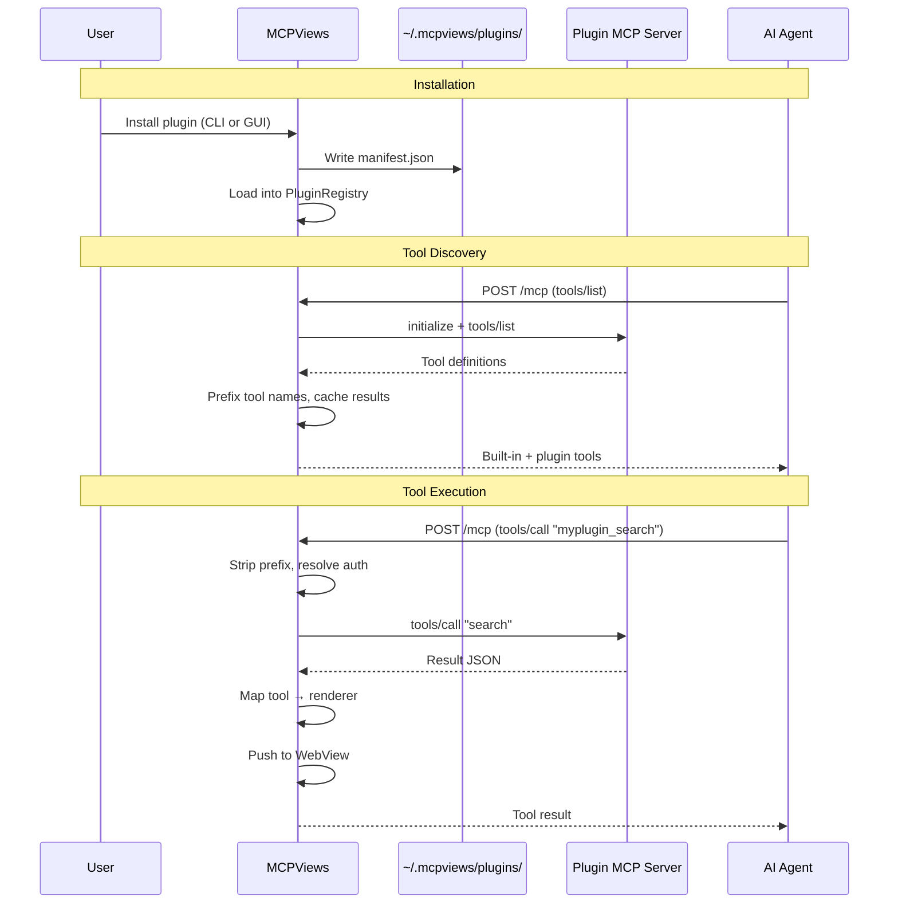
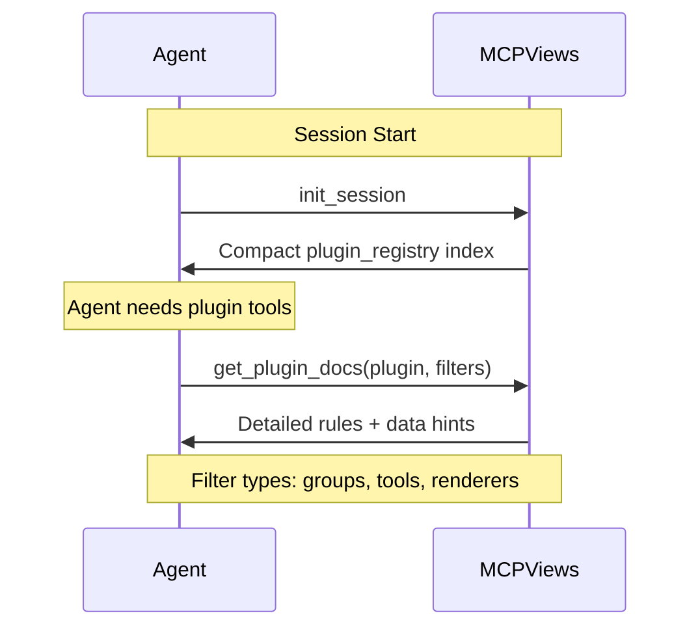
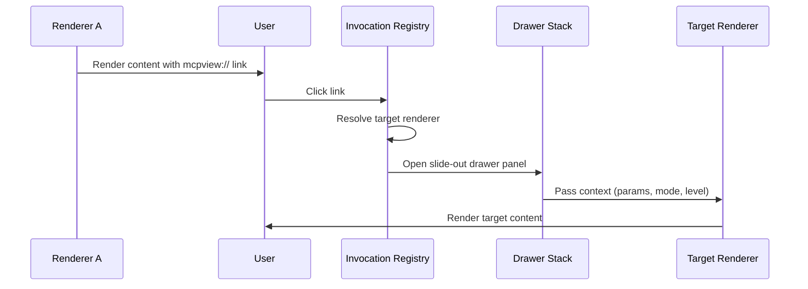
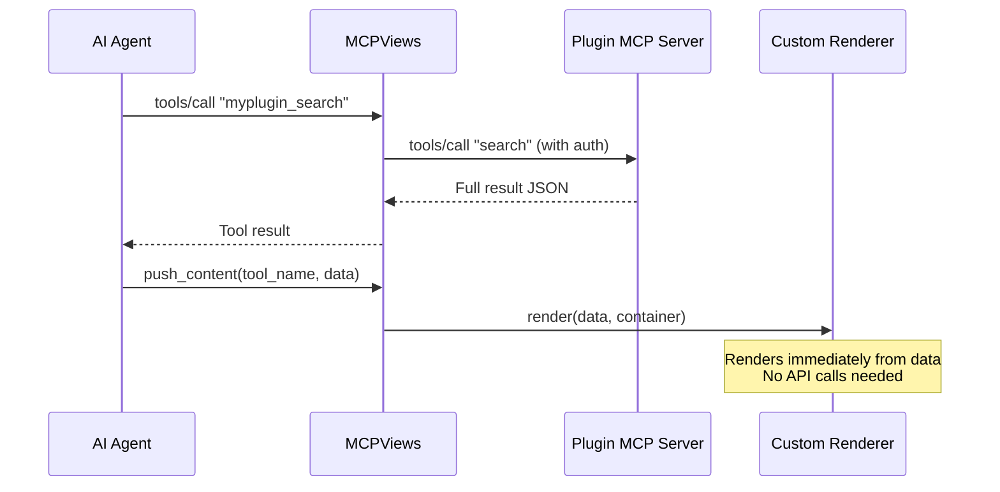
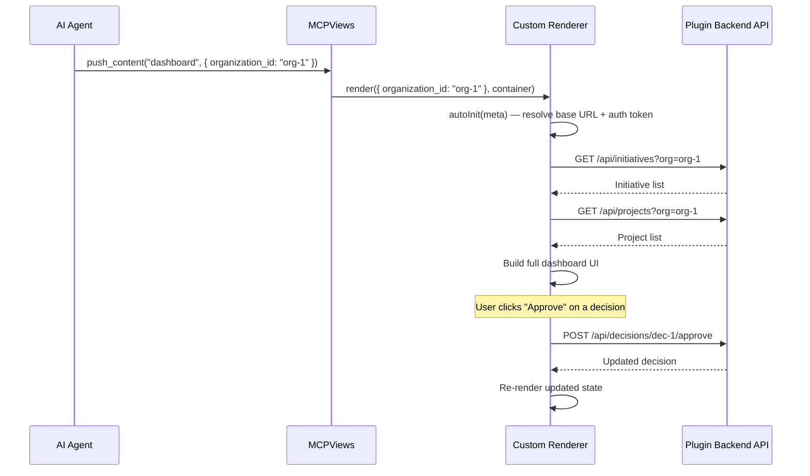

# Plugin Development Guide

This guide walks you through creating a plugin for MCPViews, from a minimal manifest to a full plugin with custom renderers, authentication, and registry publishing.

## Architecture Overview



## Plugin Lifecycle



## Quick Start: Minimal Plugin

The simplest plugin is a JSON manifest with no MCP server -- it only maps existing tools to renderers.

### 1. Create the manifest

Create `my-plugin/manifest.json`:

```json
{
  "name": "my-plugin",
  "version": "1.0.0",
  "renderers": {}
}
```

### 2. Install it

```bash
# Copy to the plugins directory
mkdir -p ~/.mcpviews/plugins/my-plugin
cp manifest.json ~/.mcpviews/plugins/my-plugin/

# Or use the CLI
mcpviews-cli plugin add-custom ./manifest.json
```

### 3. Verify

```bash
mcpviews-cli plugin list
```

## Full Plugin: MCP Server + Renderers + Auth

### Step 1: Build an MCP Server

Your server must implement the [Model Context Protocol](https://spec.modelcontextprotocol.io/) over HTTP. MCPViews connects via Streamable HTTP and performs this handshake:

1. `POST /mcp` with `initialize` request
2. `POST /mcp` with `notifications/initialized`
3. `POST /mcp` with `tools/list` to discover available tools

Any MCP SDK (TypeScript, Python, Rust, etc.) can be used. Example with the TypeScript SDK:

```typescript
import { McpServer } from "@modelcontextprotocol/sdk/server/mcp.js";

const server = new McpServer({
  name: "my-analysis-server",
  version: "1.0.0",
});

server.tool("analyze_code", { path: z.string() }, async ({ path }) => {
  const results = await performAnalysis(path);
  return {
    content: [{ type: "text", text: JSON.stringify(results) }],
  };
});
```

### Step 2: Choose Renderers

MCPViews ships with built-in renderers for general-purpose content. Domain-specific renderers are delivered via plugins (e.g., the [Ludflow plugin](https://github.com/DeeJanuz/ludflow-mcpviews) provides renderers for code analysis, data governance, and knowledge management).

#### Built-in Renderers

These are general-purpose renderers bundled with MCPViews. If no renderer is specified for a tool, `rich_content` is used as the default fallback.

| Renderer | Best For | Data Shape |
|----------|----------|------------|
| `rich_content` | Markdown, mermaid diagrams, general text | `{ title?, body, citations? }` |
| `document_preview` | Rendered markdown document | `{ title, content, status? }` |
| `document_diff` | Two-column diff with accept/reject | `{ operations: [{ type, target, replacement }] }` |
| `citation_panel` | Citation list (used as sub-component) | `{ citations: {} }` |

#### Plugin-Provided Renderers

Plugins can bundle their own renderers as JavaScript files in a `renderers/` subdirectory (see [Custom Renderers](#advanced-custom-renderers) below). For example, the Ludflow plugin provides these renderers:

| Renderer | Best For | Data Shape |
|----------|----------|------------|
| `search_results` | Grouped search results with type chips | `{ results: [{ type, items }] }` |
| `code_units` | Source code with complexity badges | `{ units: [{ name, source, complexity }] }` |
| `module_overview` | File tree + exports + dependencies | `{ files, exports, dependencies }` |
| `analysis_stats` | Metric cards + repository list | `{ stats: {}, repositories? }` |
| `knowledge_dex` | Table with bulk accept/reject | `{ entries: [{ name, type, status }] }` |
| `data_schema` | Expandable table/column view | `{ tables: [{ name, columns }] }` |
| `column_context` | Breadcrumb navigation + related entities | `{ breadcrumb, column, related }` |
| `data_draft_diff` | Grid-based draft review | `{ columns: [], changes: {} }` |
| `dependencies` | Grouped imports by source file | `{ dependencies: [{ file, imports }] }` |
| `file_content` | Source with line numbers | `{ path, content, language? }` |

### Step 3: Configure Authentication

Choose one of three auth types:

**Bearer Token** (simplest -- recommended for API keys):
```json
{
  "type": "bearer",
  "token_env": "MY_API_KEY"
}
```

**API Key** (custom header):
```json
{
  "type": "api_key",
  "header_name": "X-Custom-Key",
  "key_env": "MY_SERVICE_KEY"
}
```

**OAuth** (browser redirect flow):
```json
{
  "type": "oauth",
  "client_id": "abc123",
  "auth_url": "https://provider.com/authorize",
  "token_url": "https://provider.com/token",
  "scopes": ["read", "write"]
}
```

Token resolution order:
1. Stored token from `~/.mcpviews/auth/<plugin-name>.json` (set via GUI prompt on install)
2. Environment variable fallback (`token_env` / `key_env`)

For OAuth, MCPViews handles the full redirect flow, token storage, and automatic refresh.

### Step 4: Write the Manifest

```json
{
  "name": "my-analysis-tool",
  "version": "1.0.0",
  "renderers": {
    "analyze_code": "code_units",
    "search_files": "search_results",
    "get_summary": "rich_content"
  },
  "mcp": {
    "url": "http://localhost:9000/mcp",
    "auth": {
      "type": "bearer",
      "token_env": "MY_TOOL_API_KEY"
    },
    "tool_prefix": "mytool_"
  }
}
```

The `tool_prefix` is prepended to all your tool names to avoid collisions. An agent sees `mytool_analyze_code`; MCPViews strips the prefix before forwarding to your server as `analyze_code`.

### Step 5: Test Locally

```bash
# Install the plugin
mcpviews-cli plugin add-custom ./my-analysis-tool.json

# Verify it loaded
mcpviews-cli plugin list

# Test a tool directly via the push API
curl -X POST http://localhost:4200/api/push \
  -H 'Content-Type: application/json' \
  -d '{
    "toolName": "code_units",
    "result": {
      "data": {
        "units": [{"name": "test_fn", "source": "fn test() {}", "complexity": 1}]
      }
    }
  }'
```

## Advanced: Custom Renderers

If the built-in renderers don't fit your data, you can bundle custom renderer JavaScript files with your plugin.

### Renderer File Structure

```
my-plugin/
  manifest.json
  renderers/
    my-custom-view.js
```

### Writing a Custom Renderer

Renderers register on `window.__renderers` and export a `render(data, container)` function:

```javascript
(function () {
  'use strict';

  window.__renderers = window.__renderers || {};

  window.__renderers['my_custom_view'] = {
    render: function (data, container) {
      // data = the tool result's data field
      // container = DOM element to render into

      var heading = document.createElement('h2');
      heading.textContent = data.title || 'Custom View';
      container.appendChild(heading);

      var content = document.createElement('div');
      content.innerHTML = data.body || '';
      container.appendChild(content);
    }
  };
})();
```

### Accessing Plugin Config from Renderers

When renderers need to call your plugin's backend API (e.g., to fetch entity data in ref-only mode), they need two things: the API base URL and an auth token. MCPViews provides a standard contract for both.

#### Base URL: `window.__mcpviews_plugins`

Before any plugin renderer scripts are loaded, MCPViews injects a global config object:

```javascript
window.__mcpviews_plugins = {
  "my-plugin": {
    mcp_url: "https://api.example.com/api/mcp"
  },
  "another-plugin": {
    mcp_url: "https://other.example.com/api/mcp"
  }
};
```

Each entry is keyed by plugin name (matching `manifest.json` → `name`) and contains `mcp_url` from the manifest's `mcp.url` field. Your renderer reads its base URL from here:

```javascript
var pluginConfig = window.__mcpviews_plugins && window.__mcpviews_plugins['my-plugin'];
var baseUrl = pluginConfig
  ? pluginConfig.mcp_url.replace(/\/api\/mcp\/?$/, '/api')
  : 'http://localhost:3001/api'; // dev fallback
```

**Do not** use per-plugin globals like `window.__myPluginManifest`. The `__mcpviews_plugins` contract is the standard mechanism — it's set automatically by MCPViews and works for all plugins without any plugin-specific wiring.

#### Auth Token: Tauri `get_plugin_auth_header` Command

For auth tokens, use the Tauri IPC command:

```javascript
if (window.__TAURI__ && window.__TAURI__.core) {
  window.__TAURI__.core.invoke('get_plugin_auth_header', { pluginName: 'my-plugin' })
    .then(function(authHeader) {
      // authHeader = "Bearer <token>"
      var token = authHeader.replace(/^Bearer\s+/i, '');
      // use token for fetch() calls
    });
}
```

This resolves the token from stored OAuth credentials, environment variables, or API keys — matching the same auth resolution used for MCP tool calls.

#### Complete `autoInit` Pattern

Here's the recommended pattern for a renderer that needs API access:

```javascript
var api = {
  _baseUrl: '',
  _token: '',
  _initialized: false,

  autoInit: function(meta) {
    if (api._initialized) return Promise.resolve();

    // 1. Resolve base URL (meta override → MCPViews config → dev fallback)
    var base = '';
    if (meta && meta._api_base) {
      base = meta._api_base;
    } else if (window.__mcpviews_plugins && window.__mcpviews_plugins['my-plugin'] && window.__mcpviews_plugins['my-plugin'].mcp_url) {
      base = window.__mcpviews_plugins['my-plugin'].mcp_url.replace(/\/api\/mcp\/?$/, '/api');
    } else {
      base = 'http://localhost:3001/api';
    }
    api._baseUrl = base.replace(/\/$/, '');

    // 2. Resolve auth token
    if (window.__TAURI__ && window.__TAURI__.core && typeof window.__TAURI__.core.invoke === 'function') {
      return window.__TAURI__.core.invoke('get_plugin_auth_header', { pluginName: 'my-plugin' })
        .then(function(authHeader) {
          api._token = (authHeader || '').replace(/^Bearer\s+/i, '');
          api._initialized = true;
        })
        .catch(function() {
          api._initialized = true;
        });
    }

    api._initialized = true;
    return Promise.resolve();
  }
};
```

The resolution order for the base URL is:
1. `meta._api_base` — explicit override passed in push data
2. `window.__mcpviews_plugins[pluginName].mcp_url` — standard MCPViews config (recommended)
3. Hardcoded fallback — for local development only

### Accessing Custom Renderers

Custom renderer JS files are served via the `plugin://` URI scheme:

```
plugin://localhost/{plugin-name}/renderers/{file-name}.js?v={mtime}
```

The `?v={mtime}` query parameter is a cache-busting suffix based on the file's last-modified timestamp, added automatically by the renderer scanner.

The renderer scanner (`renderer_scanner.rs`) automatically discovers JS files in each plugin's `renderers/` directory. Map your tools to the custom renderer in the manifest:

```json
{
  "renderers": {
    "my_special_tool": "my_custom_view"
  }
}
```

## Agent Discovery and Renderer Definitions

The following diagram shows the two-tier lazy-loading flow for agent plugin documentation.



MCPViews uses a two-tier lazy-loading approach for plugin documentation, reducing session-start token usage:

1. **`init_session`** — Returns only built-in (universal) rules and a compact `plugin_registry` index. Each plugin entry lists its name, summary, tags, tool groups (with tool names and short hints), and renderer names. Agents use this index to identify which plugin provides the tools they need.

2. **`get_plugin_docs`** — Agents call this to fetch detailed rules for a specific plugin on-demand. Supports filtering by tool group name, individual tool name, or renderer name, so agents can request only the docs they need.

The plugin registry index is either read from the manifest's `registry_index` field (see below) or auto-derived from the `renderers` map and tool cache. Auto-derivation groups tools by their mapped renderer, title-cases the group names, and uses truncated tool descriptions as hints.

Under the hood, MCPViews automatically discovers plugin renderers by reading the `renderers` map and enriching entries with tool metadata from the MCP tool cache. This gives agents the renderer names and tool associations with zero plugin effort.

However, **auto-discovery cannot infer payload shapes**. The tool cache contains tool *input* schemas (what you send to the tool), not renderer *data* schemas (what the renderer expects to display). Without `renderer_definitions` entries that include `data_hint`, agents will know a renderer *exists* but won't know how to construct the `data` payload when calling `push_content`. Auto-discovery covers the "what" (renderer names + tool mappings); `renderer_definitions` covers the "how" (payload shapes + behavioral guidance).

### registry_index (Optional)

If you want to control how your plugin appears in the `init_session` plugin registry instead of relying on auto-derivation, provide a `registry_index` in your manifest:

```json
{
  "registry_index": {
    "summary": "Code analysis and search tools for your codebase",
    "tags": ["code-analysis", "search"],
    "tool_groups": [
      {
        "name": "Search",
        "hint": "Full-text and vector search across the codebase",
        "tools": ["search_codebase", "vector_search"]
      },
      {
        "name": "Code Analysis",
        "hint": "Analyze code structure and dependencies",
        "tools": ["get_code_units", "get_module_overview", "get_dependencies"]
      }
    ],
    "renderer_names": ["search_results", "code_units", "module_overview", "dependencies"]
  }
}
```

| Field | Required | Description |
|-------|----------|-------------|
| `summary` | Yes | One-line description of the plugin. |
| `tags` | Yes | Keyword tags for categorization. |
| `tool_groups` | Yes | Array of tool groups, each with a `name`, `hint`, and `tools` list. |
| `renderer_names` | Yes | List of renderer names this plugin provides. |

When `registry_index` is omitted, MCPViews auto-derives an equivalent index by grouping tools by their mapped renderer name, title-casing the group names, and using truncated tool descriptions from the tool cache as hints.

### renderer_definitions (Required for Agent Usability)

Every renderer in your `renderers` map should have a corresponding entry in `renderer_definitions` with at minimum a `data_hint` field. The `data_hint` tells agents the expected shape of the `data` object when calling `push_content` with that renderer.

```json
{
  "renderer_definitions": [
    {
      "name": "search_results",
      "description": "Grouped search results with type chips and code snippets",
      "scope": "tool",
      "tools": ["search_codebase", "vector_search"],
      "data_hint": "{ \"results\": [{ \"type\": \"string\", \"items\": [{ \"name\": \"string\", \"path\": \"string\", \"snippet\": \"string\" }] }] }"
    },
    {
      "name": "my_custom_view",
      "description": "Custom visualization for analysis results",
      "scope": "universal",
      "tools": [],
      "data_hint": "{ \"title\": \"string\", \"body\": \"markdown\" }",
      "rule": "When displaying analysis results, use push_content with tool_name 'my_custom_view'."
    }
  ]
}
```

| Field | Required | Description |
|-------|----------|-------------|
| `name` | Yes | Renderer key — must match the value used in the `renderers` map. |
| `description` | Yes | Human-readable description of what the renderer displays and when to use it. |
| `scope` | No | `"universal"` = any agent can use it directly. `"tool"` = tied to specific MCP tools (default). |
| `tools` | No | For tool-scoped renderers: which unprefixed tool names produce output for this renderer. |
| `data_hint` | **Yes** | JSON schema hint showing the expected shape of the `data` payload. This is what agents use to construct correct `push_content` calls. Without it, agents cannot format payloads. |
| `rule` | No | Behavioral rule text returned by `get_plugin_docs`/`mcpviews_setup` for agent persistence. |
| `display_mode` | No | Preferred display mode when invoked by another renderer: `"drawer"` (slide-out panel, default), `"modal"`, or `"replace"`. |
| `invoke_schema` | No | JSON schema hint for invocation parameters (e.g., `"{ id: string }"`). Setting this marks the renderer as invocable — it will appear in the frontend invocation registry and can be linked to via `mcpview://` URIs. |
| `url_patterns` | No | Array of glob patterns for auto-detecting URLs in rendered content to convert to invocation links (e.g., `["/decisions/*", "/api/decisions/*"]`). Supports `*` (single segment) and `**` (any path). |

**How auto-discovery and `renderer_definitions` interact:**

- If a renderer name appears in both `renderers` (tool mapping) and `renderer_definitions`, the explicit definition is used — including its `data_hint`, `description`, and `rule`.
- If a renderer name appears only in `renderers` (no `renderer_definitions` entry), MCPViews synthesizes a basic entry from tool cache metadata. Agents will see the renderer but won't know the payload shape. **This is a fallback, not the intended workflow.**

### Generating renderer_definitions with an AI Agent

If your plugin already has renderer JS files and a `renderers` map but no `renderer_definitions`, you can use the following prompt template with an AI agent to generate them. Copy this prompt, fill in the placeholders, and give it to an agent in your plugin's repository:

<details>
<summary>Agent prompt template — click to expand</summary>

````markdown
## Task: Add `renderer_definitions` to the plugin manifest

This MCPViews plugin has a `renderers` map that maps tool names to renderer names,
and renderer JS files in `renderers/`, but no `renderer_definitions` array in the
manifest. Agents need `renderer_definitions` to know how to format `push_content`
payloads for each renderer.

### What to do

1. Read the manifest file at `{path to your manifest.json}`.

2. For each unique renderer name in the `renderers` map:
   a. Find the corresponding JS file in the `renderers/` directory.
   b. Read the `render(data, container)` function to understand what fields the
      renderer reads from the `data` object. Look for `data.xyz` property accesses,
      destructuring patterns, and any data shape comments at the top of the file.
   c. Note: most renderers receive the raw MCP tool response as `data`. If the
      renderer accesses `data.data`, the actual shape is nested — document the
      inner shape, not the wrapper.

3. For each renderer, create a `RendererDef` entry:
   - `name`: the renderer key (e.g., `"search_results"`)
   - `description`: what the renderer displays and when it's useful (1-2 sentences)
   - `scope`: `"tool"` for renderers tied to specific tools, `"universal"` if any
     agent can use it directly
   - `tools`: list of unprefixed tool names from the `renderers` map that use this
     renderer (e.g., `["search_codebase", "vector_search"]`)
   - `data_hint`: a JSON schema hint string showing the expected shape of the `data`
     payload. Use TypeScript-style notation for readability:
     `"{ results: [{ type: string, items: [{ name: string, path: string }] }] }"`
     Include all fields the renderer actually reads. Mark optional fields with `?`.
   - `rule`: optional — only include if there are non-obvious usage constraints
   - `display_mode`: optional — `"drawer"`, `"modal"`, or `"replace"` (only if the renderer is invocable)
   - `invoke_schema`: optional — JSON schema hint for invocation params (setting this makes the renderer invocable via `mcpview://` links)
   - `url_patterns`: optional — glob patterns for auto-detecting URLs to convert to invocation links

4. Add the `renderer_definitions` array to the manifest JSON.

5. Do NOT change the `renderers` map or any other existing fields.

### Example output for one renderer

```json
{
  "name": "search_results",
  "description": "Grouped search results with citation links and type-based filtering. Supports both raw MCP results and agent-composed answers with inline citations.",
  "scope": "tool",
  "tools": ["search_codebase", "vector_search"],
  "data_hint": "{ answer?: string, citations?: { documents?: [{ index, id, title }], code?: [{ index, id, name, filePath }] }, results?: [{ type: string, items: [] }] }"
}
```

### Verification

After adding `renderer_definitions`:
- The manifest must remain valid JSON
- Every renderer name in the `renderers` map values should have a corresponding
  `renderer_definitions` entry
- Every `tools` array should only contain tool names that appear as keys in the
  `renderers` map
````

</details>

## Migrating Agent Prompts to Lazy-Load Docs

### What changed

As of commit `ce2de40`, `init_session` no longer returns plugin-specific rules, tool summaries, or renderer definitions. Instead it returns:

- Built-in (universal) renderer rules (`rich_content`, `structured_data`)
- A compact `plugin_registry` index listing each installed plugin with its name, summary, tags, tool groups, and renderer names

Plugin-specific rules are now fetched on-demand via the new `get_plugin_docs` tool. This keeps session-start token usage minimal and avoids loading documentation for plugins the agent never uses in a given conversation.

### What plugin providers need to update

If your agent prompts or instructions tell agents to get all rules from `init_session`, you need to update them to use the two-step flow:

1. **`init_session`** -- Scan the `plugin_registry` in the response to find the relevant plugin by name or tags.
2. **`get_plugin_docs`** -- Fetch detailed rules for that plugin, with optional filters for specific tool groups, tools, or renderers.

### Before/After agent prompt example

**Before (old -- no longer works):**
```
Call init_session at the start of every conversation. The response contains all
renderer rules, data hints, and tool rules for all installed plugins.
```

**After (new -- lazy-load):**
```
Call init_session at the start of every conversation. The response contains:
- Built-in renderer rules (rich_content, structured_data)
- A plugin_registry index listing installed plugins with their tool groups and renderer names

When you need to use a plugin's tools or renderers, call get_plugin_docs with the
plugin name to fetch detailed rules. You can filter by:
- groups: ["Search", "Code Analysis"] — fetch rules for a tool group
- tools: ["search_codebase"] — fetch rules for specific tools
- renderers: ["search_results"] — fetch rules for specific renderers
```

### Note about `mcpviews_setup`

`mcpviews_setup` (the one-time setup tool for first-time users) still returns all rules including plugin rules via the older `gather_session_data` path. First-time setup flows continue to get everything in a single call. Only the per-session `init_session` is slimmed down.

### Backward compatibility

Agents that do not call `get_plugin_docs` will still work for built-in renderers (`rich_content`, `structured_data`) but will not have access to plugin-specific renderer rules or data hints. Plugin-specific tools will still appear in the MCP tools list (via `tools/list`), but agents will lack the behavioral guidance from plugin rules. To get full plugin documentation, agents must call `get_plugin_docs`.

### tool_rules

Per-tool behavioral rules (tool names are auto-prefixed):

```json
{
  "tool_rules": {
    "analyze_code": "Always include the file path when calling this tool.",
    "search_files": "Limit results to 50 items for performance."
  }
}
```

### plugin_rules

High-level behavioral rules for the plugin that agents see every session. Unlike `tool_rules` (which are per-tool and only returned when that tool's docs are requested), `plugin_rules` are always included in `init_session`, `mcpviews_setup`, and `get_plugin_docs` responses regardless of any tool/renderer filters.

```json
{
  "plugin_rules": [
    "Always prefer vector search over full-text search for semantic queries.",
    "When displaying code analysis results, include the file path context."
  ]
}
```

Each rule is a plain string. Rules are returned in the `rules` array with `"category": "plugin"` and `"source": "<plugin-name>"`. They also appear in the `plugin_registry` compact index returned by `init_session`, so agents can see them without calling `get_plugin_docs`.

Use `plugin_rules` for cross-cutting behavioral guidance that applies to the plugin as a whole. Use `tool_rules` for tool-specific instructions.

## Plugin Prompts

Plugins can define guided workflow prompts that are discoverable via the MCP `prompts/list` protocol and fetchable via `get_plugin_prompt` or `prompts/get`. Prompts are markdown files bundled with the plugin that support template argument substitution.

### Defining Prompts

Add a `prompt_definitions` array to your manifest and include the prompt markdown files in your plugin directory:

```
my-plugin/
  manifest.json
  prompts/
    onboarding.md
    analysis-workflow.md
  renderers/
    ...
```

**manifest.json:**
```json
{
  "name": "my-plugin",
  "version": "1.0.0",
  "prompt_definitions": [
    {
      "name": "onboarding",
      "description": "Guided setup for the analysis plugin",
      "source": "prompts/onboarding.md",
      "arguments": []
    },
    {
      "name": "analyze",
      "description": "Step-by-step code analysis workflow",
      "source": "prompts/analysis-workflow.md",
      "arguments": [
        { "name": "project_path", "description": "Path to the project to analyze", "required": true }
      ]
    }
  ]
}
```

### Template Arguments

Prompt source files can include `{{argument_name}}` placeholders that are replaced with provided values at fetch time:

```markdown
# Analysis Workflow

Analyze the project at `{{project_path}}` using these steps:
1. Call `analyze_code` with the project path
2. Review the results in the code_units renderer
```

### How Prompts Are Discovered

Plugin prompts are namespaced as `{plugin}/{prompt}` in the MCP prompts protocol:

- **`prompts/list`** returns `my-plugin/onboarding`, `my-plugin/analyze`, etc.
- **`prompts/get`** with `name: "my-plugin/analyze"` fetches and renders the prompt
- **`get_plugin_prompt`** tool provides the same functionality with explicit `plugin` and `prompt` parameters

The `init_session` plugin registry also includes a `prompts` array for each installed plugin, so agents can discover available prompts without calling `prompts/list`.

## Cross-Renderer Invocation

The following diagram shows how a cross-renderer invocation flows from a link click to the target renderer opening in a drawer.



Renderers can link to other renderers using the `mcpview://` URI protocol. When a user clicks an invocation link, the target renderer opens in a stacking slide-out drawer panel.

### mcpview:// Links in Markdown

In any markdown content rendered by `rich_content`, use the `mcpview://` protocol:

```markdown
See [Decision Details](mcpview://decision_detail?id=dec-123)
```

This renders as a clickable button that opens the `decision_detail` renderer in a drawer with `{ id: "dec-123" }` as params.

### Making a Renderer Invocable

To make your renderer available for cross-renderer invocation, add `invoke_schema` to its `renderer_definitions` entry:

```json
{
  "name": "decision_detail",
  "description": "Decision detail view",
  "scope": "universal",
  "data_hint": "{ id: string, title?: string }",
  "invoke_schema": "{ id: string }",
  "display_mode": "drawer",
  "url_patterns": ["/decisions/*"]
}
```

- `invoke_schema` is required — only renderers with this field appear in the invocation registry
- `display_mode` controls how the renderer opens: `"drawer"` (default), `"modal"`, or `"replace"`
- `url_patterns` enable auto-detection: `<a>` tags in rendered content whose `href` matches a pattern are automatically converted to invocation buttons

### URL Pattern Auto-Detection

If your renderer defines `url_patterns`, the invocation registry scans rendered content for matching `<a>` links and converts them to invocation buttons. Patterns support `*` (any single path segment) and `**` (any path depth):

```json
"url_patterns": ["/decisions/*", "/api/v*/decisions/*"]
```

### Renderer Function Signature (Drawer Context)

When invoked in a drawer, your renderer receives an additional `context` parameter:

```javascript
window.__renderers['my_renderer'] = function(container, data, meta, toolArgs, reviewRequired, onDecision, context) {
  // context.mode = 'drawer' | 'modal' | 'replace'
  // context.params = { id: 'dec-123', ... } from the mcpview:// URI
  // context.level = drawer stack depth (0-based)
  // context.invoke(rendererName, params) = open another renderer from within
};
```

## CSP and Plugin API Access

MCPViews dynamically builds the Content Security Policy `connect-src` directive to include the origins of all installed plugin MCP URLs. This means custom renderers bundled with your plugin can use `fetch()` to call your plugin's API directly from the browser without being blocked by CSP.

When a new plugin is installed, MCPViews reloads the webview so the updated CSP takes effect immediately. No plugin configuration is needed -- the origin is extracted automatically from the `mcp.url` field in your manifest. For example, if your manifest has `"url": "https://api.example.com/mcp"`, then `https://api.example.com` is added to `connect-src`.

## Renderer Interaction Patterns

Renderers can interact with data in two fundamentally different ways. Most plugins use one or both of these patterns.

### Pattern 1: MCP Pass-Through (Full Data Push)

The agent calls an MCP tool, receives the full result, and pushes it to the renderer via `push_content`. The renderer is stateless — it receives everything it needs in the `data` parameter and renders it immediately.



**When to use:** The MCP tool returns all the data the renderer needs. Good for search results, analysis output, read-only reports, and any content where the agent already has the complete payload.

**Example — search results renderer:**

```javascript
window.__renderers['search_results'] = function(container, data, meta) {
  container.innerHTML = '';
  // data contains everything: { results: [{ type, items }] }
  var results = data.results || [];
  for (var i = 0; i < results.length; i++) {
    var group = results[i];
    var section = document.createElement('div');
    section.innerHTML = '<h3>' + group.type + '</h3>';
    // ... render each item from the data payload
    container.appendChild(section);
  }
};
```

The agent controls what data reaches the renderer. The renderer has no independent data access.

### Pattern 2: API Hydration (Reference Push)

The agent pushes only a lightweight reference (e.g., an entity ID or a filter set), and the renderer fetches the full data directly from the plugin's backend API via `fetch()`. This enables interactive, live UIs that can refresh, paginate, and respond to user actions without round-tripping through the agent.



**When to use:** The renderer needs to display a rich, interactive view that goes beyond what the agent pushed. Dashboards, detail views with navigation, forms with submit actions, and any UI where the user interacts directly with the backend.

**Key requirements:**
- Your plugin's `mcp.url` must be set — MCPViews adds it to the CSP `connect-src` so `fetch()` works
- Use the `autoInit` pattern (below) to resolve the API base URL and auth token
- The MCP push is lightweight — just enough for the renderer to know what to fetch

#### Shared API Client Pattern

The recommended architecture separates the API client into a shared file that all renderers import via `window` globals. This avoids duplicating init/auth logic across renderers.

**File structure:**

```
my-plugin/
  manifest.json
  renderers/
    shared/
      00-api-client.js    ← Shared API client (loaded first)
    dashboard.js          ← Renderer using API hydration
    detail-view.js        ← Another renderer using API hydration
```

**`shared/00-api-client.js`** — Shared API client with `autoInit`:

```javascript
(function() {
  'use strict';

  var _token = '';

  function _headers(withBody) {
    var h = {};
    if (_token) h['Authorization'] = 'Bearer ' + _token;
    if (withBody) h['Content-Type'] = 'application/json';
    return h;
  }

  function _handleResponse(response) {
    if (!response.ok) throw new Error('API error: ' + response.status);
    return response.json();
  }

  // Retry on 401 — refresh token and retry once
  function _fetchWithRetry(url, opts) {
    return fetch(url, opts).then(function(response) {
      if (response.status === 401 && window.__TAURI__ && window.__TAURI__.core) {
        // Token expired — refresh and retry
        return window.__TAURI__.core.invoke('get_plugin_auth_header', { pluginName: 'my-plugin' })
          .then(function(authHeader) {
            _token = (authHeader || '').replace(/^Bearer\s+/i, '');
            var retryOpts = Object.assign({}, opts, { headers: _headers(!!opts.body) });
            return fetch(url, retryOpts).then(_handleResponse);
          });
      }
      return _handleResponse(response);
    });
  }

  var api = {
    _baseUrl: '',
    _initialized: false,

    autoInit: function(meta) {
      if (api._initialized) return Promise.resolve();

      // 1. Resolve base URL
      var base = '';
      if (meta && meta._api_base) {
        base = meta._api_base;
      } else if (window.__mcpviews_plugins
                 && window.__mcpviews_plugins['my-plugin']
                 && window.__mcpviews_plugins['my-plugin'].mcp_url) {
        base = window.__mcpviews_plugins['my-plugin'].mcp_url
               .replace(/\/api\/mcp\/?$/, '/api');
      } else {
        base = 'http://localhost:3001/api';  // dev fallback
      }
      api._baseUrl = base.replace(/\/$/, '');

      // 2. Resolve auth token via Tauri IPC
      if (window.__TAURI__ && window.__TAURI__.core) {
        return window.__TAURI__.core.invoke('get_plugin_auth_header', { pluginName: 'my-plugin' })
          .then(function(authHeader) {
            _token = (authHeader || '').replace(/^Bearer\s+/i, '');
            api._initialized = true;
          })
          .catch(function() { api._initialized = true; });
      }

      api._initialized = true;
      return Promise.resolve();
    },

    // Convenience wrapper: show loading, init, then call render function
    withReady: function(container, meta, renderFn) {
      container.innerHTML = '<div style="padding:16px;color:var(--text-secondary);">'
        + 'Loading...</div>';
      api.autoInit(meta).then(function() {
        renderFn(api);
      }).catch(function(err) {
        container.innerHTML = '<div style="color:var(--color-error-text);padding:16px;">'
          + 'Failed to initialize: ' + err.message + '</div>';
      });
    },

    get: function(path) {
      return _fetchWithRetry(api._baseUrl + path, {
        method: 'GET', headers: _headers(false)
      });
    },

    post: function(path, body) {
      return _fetchWithRetry(api._baseUrl + path, {
        method: 'POST', headers: _headers(true), body: JSON.stringify(body)
      });
    }
  };

  window.__myPluginAPI = api;
})();
```

**`dashboard.js`** — Renderer that hydrates from the API:

```javascript
(function() {
  'use strict';
  window.__renderers = window.__renderers || {};

  window.__renderers.my_dashboard = function(container, data, meta) {
    container.innerHTML = '';
    var API = window.__myPluginAPI;

    // data is lightweight: { organization_id: "org-1" }
    API.withReady(container, meta, function() {
      // Now fetch the real data from the backend
      Promise.all([
        API.get('/initiatives?org=' + data.organization_id),
        API.get('/projects?org=' + data.organization_id),
        API.get('/tasks?status=open&org=' + data.organization_id)
      ]).then(function(results) {
        var initiatives = results[0].data || [];
        var projects = results[1].data || [];
        var tasks = results[2].data || [];

        container.innerHTML = '';
        // Build the full dashboard from fetched data
        renderDashboard(container, initiatives, projects, tasks);
      });
    });
  };

  function renderDashboard(container, initiatives, projects, tasks) {
    // ... build interactive dashboard UI
    // User actions (approve, transition, etc.) call API.post() directly
  }
})();
```

**How the agent uses it:**

The agent only needs to push a lightweight reference. The renderer handles everything else:

```
Agent: push_content({ tool_name: "my_dashboard", data: { organization_id: "org-1" } })
```

The renderer receives `{ organization_id: "org-1" }`, calls `autoInit` to resolve the API URL and auth token, then fetches initiatives, projects, and tasks directly from the backend. User actions (clicking "Approve", transitioning a status) are handled entirely within the renderer via `API.post()` — no agent involvement needed.

#### Combining Both Patterns

Many plugins use both patterns depending on the renderer. For example:

| Renderer | Pattern | Why |
|----------|---------|-----|
| `search_results` | MCP pass-through | Agent already has the search results from the MCP tool call |
| `dashboard` | API hydration | Needs to aggregate multiple API calls and support live interaction |
| `detail_view` | API hydration | Receives just an entity ID, fetches full details + related entities |
| `code_units` | MCP pass-through | Code analysis output comes from the MCP tool |
| `data_review` | Both | MCP push provides the proposed changes; renderer fetches current state for comparison |

**Manifest for a mixed plugin:**

```json
{
  "name": "my-plugin",
  "version": "1.0.0",
  "renderers": {
    "search_files": "search_results",
    "get_overview": "dashboard"
  },
  "renderer_definitions": [
    {
      "name": "search_results",
      "description": "Search results display",
      "scope": "tool",
      "tools": ["search_files"],
      "data_hint": "{ results: [{ type: string, items: [] }] }"
    },
    {
      "name": "dashboard",
      "description": "Interactive dashboard — fetches live data from the API",
      "scope": "universal",
      "tools": [],
      "data_hint": "{ organization_id: string }",
      "rule": "Push only the organization_id. The renderer fetches all data via API."
    }
  ],
  "mcp": {
    "url": "https://api.example.com/mcp",
    "auth": { "type": "oauth", "auth_url": "...", "token_url": "..." },
    "tool_prefix": "myplugin_"
  }
}
```

Note the `data_hint` difference: `search_results` expects the full payload, while `dashboard` expects only a reference ID. The `rule` on the dashboard renderer tells the agent not to try to pre-fetch dashboard data — the renderer handles it.

#### Auth Token Lifecycle in API-Hydrating Renderers

When a renderer calls your backend API directly, it needs a valid auth token. The `autoInit` pattern handles this automatically:

1. **Initial token**: Resolved via `get_plugin_auth_header` Tauri IPC command during `autoInit()`
2. **Token refresh**: If a `fetch()` returns `401`, the `_fetchWithRetry` wrapper calls `get_plugin_auth_header` again (which triggers OAuth refresh if needed), then retries the request once
3. **Token storage**: MCPViews stores tokens in `~/.mcpviews/auth/<plugin>.json` — the renderer never touches disk

This means renderers get the same token lifecycle (stored → env fallback → OAuth refresh) as MCP tool calls, without any renderer-specific auth code.

## Auto-Push Removed (Explicit Push Only)

Plugin tool results are no longer auto-pushed to the companion window. Content only appears when the coordinator agent explicitly calls `push_content` or `push_review`. This prevents sub-agent research calls from flooding the UI with unwanted content.

The `no_auto_push` manifest field is still accepted for backward compatibility but has no effect since auto-push has been removed entirely.

## ZIP Plugin Packages

For distribution, plugins can be packaged as ZIP archives:

```
my-plugin.zip
  manifest.json
  renderers/
    my-custom-view.js
  assets/
    icon.png
```

**Conventions:**
- The ZIP must contain a valid `manifest.json`
- GitHub release pattern: if all files share a single top-level directory, it's automatically stripped during extraction
- Zip-slip protection: paths containing `..` are rejected
- Max download size: 50MB for remote downloads

Plugins are extracted to `~/.mcpviews/plugins/{plugin-name}/`.

### Distributing via Download URL

Add a `download_url` to your registry entry pointing to the ZIP:

```json
{
  "name": "my-plugin",
  "version": "1.0.0",
  "description": "My analysis plugin",
  "download_url": "https://github.com/you/my-plugin/releases/download/v1.0.0/my-plugin.zip",
  "manifest": { ... }
}
```

## Publishing to the Registry

To list your plugin in the official registry:

1. Create a `RegistryEntry` with your manifest, description, and tags:

```json
{
  "name": "my-plugin",
  "version": "1.0.0",
  "description": "Short description for search results and the GUI",
  "author": "Your Name",
  "homepage": "https://github.com/you/my-plugin",
  "tags": ["analysis", "code-quality"],
  "manifest": {
    "name": "my-plugin",
    "version": "1.0.0",
    "renderers": { ... },
    "mcp": { ... }
  }
}
```

2. Submit a pull request to the registry repository adding your entry to `registry.json`.

## Hosting a Private Registry

Organizations can host their own plugin registries. A registry is a JSON file with this structure:

```json
{
  "version": "1",
  "plugins": [ ... ]
}
```

Configure MCPViews to use it by editing `~/.mcpviews/config.json`:

```json
{
  "registry_sources": [
    { "name": "Default", "url": "https://...", "enabled": true },
    { "name": "Internal", "url": "https://corp.example.com/registry.json", "enabled": true }
  ]
}
```

Multiple sources are merged; last source wins on name conflicts. Each source has its own 1-hour disk cache.

## Complete Example Manifest

A full-featured plugin manifest with all optional fields:

```json
{
  "name": "acme-analysis",
  "version": "2.1.0",
  "renderers": {
    "analyze_code": "code_units",
    "search_files": "search_results",
    "get_overview": "module_overview",
    "custom_report": "acme_report"
  },
  "registry_index": {
    "summary": "ACME code analysis with custom reporting",
    "tags": ["code-analysis", "reporting"],
    "tool_groups": [
      {
        "name": "Analysis",
        "hint": "Analyze code and generate reports",
        "tools": ["analyze_code", "custom_report"]
      },
      {
        "name": "Search",
        "hint": "Search files and get project overview",
        "tools": ["search_files", "get_overview"]
      }
    ],
    "renderer_names": ["code_units", "search_results", "module_overview", "acme_report"]
  },
  "renderer_definitions": [
    {
      "name": "acme_report",
      "description": "Custom ACME analysis report with charts and metrics",
      "scope": "tool",
      "tools": ["custom_report"],
      "data_hint": "{ \"title\": \"string\", \"metrics\": [{\"name\": \"string\", \"value\": \"number\"}], \"body\": \"markdown\" }",
      "rule": "Use push_content with tool_name 'acme_report' when displaying analysis reports.",
      "display_mode": "drawer",
      "invoke_schema": "{ report_id: string }",
      "url_patterns": ["/reports/*", "/api/reports/*"]
    }
  ],
  "tool_rules": {
    "analyze_code": "Always specify language parameter for best results.",
    "search_files": "Limit to 100 results per call."
  },
  "no_auto_push": [
    "write_report",
    "delete_analysis"
  ],
  "mcp": {
    "url": "https://api.acme.com/mcp",
    "auth": {
      "type": "oauth",
      "client_id": "acme-mux-plugin",
      "auth_url": "https://auth.acme.com/authorize",
      "token_url": "https://auth.acme.com/token",
      "scopes": ["read", "analyze"]
    },
    "tool_prefix": "acme_"
  }
}
```

## Release Convention

Providers can manage plugin versions entirely from their own repository by using `manifest_url` in the registry entry. This eliminates the need to submit pull requests to the MCPViews registry for every release.

### Provider Repo Structure

```
plugin/
  manifest.json       # Always reflects the current release
  release/
    {name}.zip        # Latest ZIP package (optional)
```

### How It Works

1. The MCPViews registry entry includes a `manifest_url` pointing to the raw `manifest.json` in the provider's repo:
   ```json
   {
     "name": "my-plugin",
     "manifest_url": "https://raw.githubusercontent.com/org/repo/master/plugin/manifest.json",
     "description": "My plugin description",
     "author": "Author Name"
   }
   ```

2. The provider's `manifest.json` includes `version` and `download_url`:
   ```json
   {
     "name": "my-plugin",
     "version": "1.2.0",
     "download_url": "https://github.com/org/repo/releases/download/v1.2.0/my-plugin.zip",
     "renderers": { ... },
     "mcp": { ... }
   }
   ```

3. When MCPViews fetches the registry, it resolves each `manifest_url` to get the current version and download location.

4. To release a new version, the provider:
   - Bumps `version` in `plugin/manifest.json`
   - Updates `download_url` to point to the new release asset
   - Creates a GitHub release with the ZIP attached
   - No MCPViews PR needed

### Versioned Archives

Use GitHub releases tagged `v{version}` with ZIP assets:

```
https://github.com/org/repo/releases/download/v1.2.0/my-plugin.zip
```

The `download_url` in `manifest.json` should always point to the latest versioned release asset.

## Troubleshooting

**Plugin not loading:**
- Check `mcpviews-cli plugin list` -- is it listed?
- Look at the MCPViews logs for `[mcpviews] Failed to parse plugin` errors
- Verify `manifest.json` is valid JSON with required `name` and `version` fields

**Tools not appearing:**
- Ensure your MCP server is running and accessible at the configured URL
- Tool discovery has a 5-minute cache TTL -- use `POST /api/reload-plugins` to force refresh
- Check that `tool_prefix` is set (required for MCP plugins)

**Auth failures:**
- Bearer/API Key: check the environment variable is set, or configure via the Plugin Manager GUI
- OAuth: verify `auth_url` and `token_url` are correct and the redirect flow completes
- Tokens are stored in `~/.mcpviews/auth/<plugin-name>.json` -- delete this file to re-authenticate

**Custom renderer not rendering:**
- Verify the JS file is in `{plugin-dir}/renderers/` with a `.js` extension
- Check that the renderer key in `window.__renderers['key']` matches the `renderers` mapping in the manifest
- The `plugin://` URI scheme must be accessible -- check the Tauri dev tools console for errors

**Hot reload:**
- `POST /api/reload-plugins` reloads all plugins from disk
- Connected MCP clients receive a `notifications/tools/list_changed` notification
- Renderer JS URLs include `?v={mtime}` cache-busting parameters, so reinstalling a plugin loads new JS without needing an uninstall/reinstall cycle
- The `plugin://` protocol sets `Cache-Control: no-store` to prevent the webview from serving stale renderer scripts
