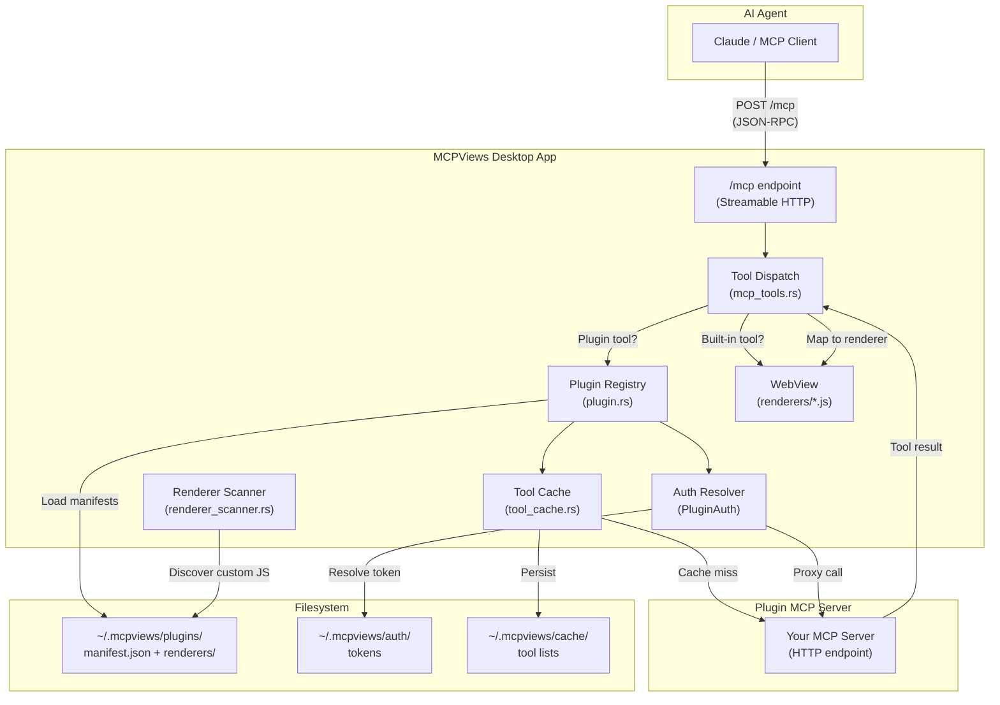
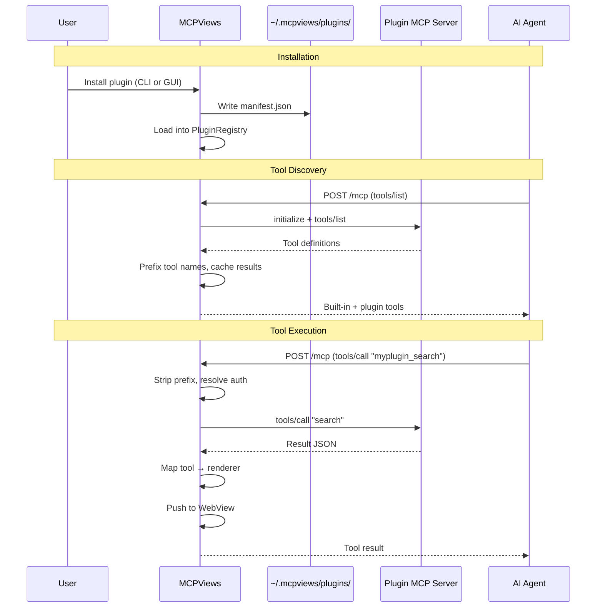

# Plugin Development Guide

This guide walks you through creating a plugin for MCPViews, from a minimal manifest to a full plugin with custom renderers, authentication, and registry publishing.

## Architecture Overview



## Plugin Lifecycle



## Quick Start: Minimal Plugin

The simplest plugin is a JSON manifest with no MCP server -- it only maps existing tools to renderers.

### 1. Create the manifest

Create `my-plugin/manifest.json`:

```json
{
  "name": "my-plugin",
  "version": "1.0.0",
  "renderers": {}
}
```

### 2. Install it

```bash
# Copy to the plugins directory
mkdir -p ~/.mcpviews/plugins/my-plugin
cp manifest.json ~/.mcpviews/plugins/my-plugin/

# Or use the CLI
mcpviews-cli plugin add-custom ./manifest.json
```

### 3. Verify

```bash
mcpviews-cli plugin list
```

## Full Plugin: MCP Server + Renderers + Auth

### Step 1: Build an MCP Server

Your server must implement the [Model Context Protocol](https://spec.modelcontextprotocol.io/) over HTTP. MCPViews connects via Streamable HTTP and performs this handshake:

1. `POST /mcp` with `initialize` request
2. `POST /mcp` with `notifications/initialized`
3. `POST /mcp` with `tools/list` to discover available tools

Any MCP SDK (TypeScript, Python, Rust, etc.) can be used. Example with the TypeScript SDK:

```typescript
import { McpServer } from "@modelcontextprotocol/sdk/server/mcp.js";

const server = new McpServer({
  name: "my-analysis-server",
  version: "1.0.0",
});

server.tool("analyze_code", { path: z.string() }, async ({ path }) => {
  const results = await performAnalysis(path);
  return {
    content: [{ type: "text", text: JSON.stringify(results) }],
  };
});
```

### Step 2: Choose Renderers

MCPViews ships with built-in renderers for general-purpose content. Domain-specific renderers are delivered via plugins (e.g., the [Ludflow plugin](https://github.com/DeeJanuz/ludflow-mcp-mux) provides renderers for code analysis, data governance, and knowledge management).

#### Built-in Renderers

These are general-purpose renderers bundled with MCPViews. If no renderer is specified for a tool, `rich_content` is used as the default fallback.

| Renderer | Best For | Data Shape |
|----------|----------|------------|
| `rich_content` | Markdown, mermaid diagrams, general text | `{ title?, body, citations? }` |
| `document_preview` | Rendered markdown document | `{ title, content, status? }` |
| `document_diff` | Two-column diff with accept/reject | `{ operations: [{ type, target, replacement }] }` |
| `citation_panel` | Citation list (used as sub-component) | `{ citations: {} }` |

#### Plugin-Provided Renderers

Plugins can bundle their own renderers as JavaScript files in a `renderers/` subdirectory (see [Custom Renderers](#advanced-custom-renderers) below). For example, the Ludflow plugin provides these renderers:

| Renderer | Best For | Data Shape |
|----------|----------|------------|
| `search_results` | Grouped search results with type chips | `{ results: [{ type, items }] }` |
| `code_units` | Source code with complexity badges | `{ units: [{ name, source, complexity }] }` |
| `module_overview` | File tree + exports + dependencies | `{ files, exports, dependencies }` |
| `analysis_stats` | Metric cards + repository list | `{ stats: {}, repositories? }` |
| `knowledge_dex` | Table with bulk accept/reject | `{ entries: [{ name, type, status }] }` |
| `data_schema` | Expandable table/column view | `{ tables: [{ name, columns }] }` |
| `column_context` | Breadcrumb navigation + related entities | `{ breadcrumb, column, related }` |
| `data_draft_diff` | Grid-based draft review | `{ columns: [], changes: {} }` |
| `dependencies` | Grouped imports by source file | `{ dependencies: [{ file, imports }] }` |
| `file_content` | Source with line numbers | `{ path, content, language? }` |

### Step 3: Configure Authentication

Choose one of three auth types:

**Bearer Token** (simplest -- recommended for API keys):
```json
{
  "type": "bearer",
  "token_env": "MY_API_KEY"
}
```

**API Key** (custom header):
```json
{
  "type": "api_key",
  "header_name": "X-Custom-Key",
  "key_env": "MY_SERVICE_KEY"
}
```

**OAuth** (browser redirect flow):
```json
{
  "type": "oauth",
  "client_id": "abc123",
  "auth_url": "https://provider.com/authorize",
  "token_url": "https://provider.com/token",
  "scopes": ["read", "write"]
}
```

Token resolution order:
1. Stored token from `~/.mcpviews/auth/<plugin-name>.json` (set via GUI prompt on install)
2. Environment variable fallback (`token_env` / `key_env`)

For OAuth, MCPViews handles the full redirect flow, token storage, and automatic refresh.

### Step 4: Write the Manifest

```json
{
  "name": "my-analysis-tool",
  "version": "1.0.0",
  "renderers": {
    "analyze_code": "code_units",
    "search_files": "search_results",
    "get_summary": "rich_content"
  },
  "mcp": {
    "url": "http://localhost:9000/mcp",
    "auth": {
      "type": "bearer",
      "token_env": "MY_TOOL_API_KEY"
    },
    "tool_prefix": "mytool_"
  }
}
```

The `tool_prefix` is prepended to all your tool names to avoid collisions. An agent sees `mytool_analyze_code`; MCPViews strips the prefix before forwarding to your server as `analyze_code`.

### Step 5: Test Locally

```bash
# Install the plugin
mcpviews-cli plugin add-custom ./my-analysis-tool.json

# Verify it loaded
mcpviews-cli plugin list

# Test a tool directly via the push API
curl -X POST http://localhost:4200/api/push \
  -H 'Content-Type: application/json' \
  -d '{
    "toolName": "code_units",
    "result": {
      "data": {
        "units": [{"name": "test_fn", "source": "fn test() {}", "complexity": 1}]
      }
    }
  }'
```

## Advanced: Custom Renderers

If the built-in renderers don't fit your data, you can bundle custom renderer JavaScript files with your plugin.

### Renderer File Structure

```
my-plugin/
  manifest.json
  renderers/
    my-custom-view.js
```

### Writing a Custom Renderer

Renderers register on `window.__renderers` and export a `render(data, container)` function:

```javascript
(function () {
  'use strict';

  window.__renderers = window.__renderers || {};

  window.__renderers['my_custom_view'] = {
    render: function (data, container) {
      // data = the tool result's data field
      // container = DOM element to render into

      var heading = document.createElement('h2');
      heading.textContent = data.title || 'Custom View';
      container.appendChild(heading);

      var content = document.createElement('div');
      content.innerHTML = data.body || '';
      container.appendChild(content);
    }
  };
})();
```

### Accessing Custom Renderers

Custom renderer JS files are served via the `plugin://` URI scheme:

```
plugin://localhost/{plugin-name}/renderers/{file-name}.js
```

The renderer scanner (`renderer_scanner.rs`) automatically discovers JS files in each plugin's `renderers/` directory. Map your tools to the custom renderer in the manifest:

```json
{
  "renderers": {
    "my_special_tool": "my_custom_view"
  }
}
```

## Agent Discovery and Renderer Definitions

When an agent starts a session, MCPViews tells it which renderers are available and how to format payloads for each one. This happens automatically through two mechanisms:

1. **Auto-discovery** — MCPViews reads the `renderers` map and the tool cache to learn which renderers exist and which tools map to them. This gives agents the renderer names and tool associations with zero plugin effort.

2. **`renderer_definitions`** — The plugin provides structured metadata including `data_hint` (the payload shape) and optional `description` and `rule` fields. **This is essential** because MCPViews cannot infer what data shape each renderer expects from the tool cache alone.

Without `renderer_definitions`, agents will know a renderer *exists* but won't know how to construct the `data` payload when calling `push_content`. Auto-discovery covers the "what" (renderer names + tool mappings); `renderer_definitions` covers the "how" (payload shapes + behavioral guidance).

### renderer_definitions (Required for Agent Usability)

Every renderer in your `renderers` map should have a corresponding entry in `renderer_definitions` with at minimum a `data_hint` field. The `data_hint` tells agents the expected shape of the `data` object when calling `push_content` with that renderer.

```json
{
  "renderer_definitions": [
    {
      "name": "search_results",
      "description": "Grouped search results with type chips and code snippets",
      "scope": "tool",
      "tools": ["search_codebase", "vector_search"],
      "data_hint": "{ \"results\": [{ \"type\": \"string\", \"items\": [{ \"name\": \"string\", \"path\": \"string\", \"snippet\": \"string\" }] }] }"
    },
    {
      "name": "my_custom_view",
      "description": "Custom visualization for analysis results",
      "scope": "universal",
      "tools": [],
      "data_hint": "{ \"title\": \"string\", \"body\": \"markdown\" }",
      "rule": "When displaying analysis results, use push_content with tool_name 'my_custom_view'."
    }
  ]
}
```

| Field | Required | Description |
|-------|----------|-------------|
| `name` | Yes | Renderer key — must match the value used in the `renderers` map. |
| `description` | Yes | Human-readable description of what the renderer displays and when to use it. |
| `scope` | No | `"universal"` = any agent can use it directly. `"tool"` = tied to specific MCP tools (default). |
| `tools` | No | For tool-scoped renderers: which unprefixed tool names produce output for this renderer. |
| `data_hint` | **Yes** | JSON schema hint showing the expected shape of the `data` payload. This is what agents use to construct correct `push_content` calls. Without it, agents cannot format payloads. |
| `rule` | No | Behavioral rule text returned by `setup_agent_rules` for agent persistence. |

**How auto-discovery and `renderer_definitions` interact:**

- If a renderer name appears in both `renderers` (tool mapping) and `renderer_definitions`, the explicit definition is used — including its `data_hint`, `description`, and `rule`.
- If a renderer name appears only in `renderers` (no `renderer_definitions` entry), MCPViews synthesizes a basic entry from tool cache metadata. Agents will see the renderer but won't know the payload shape. **This is a fallback, not the intended workflow.**

### Generating renderer_definitions with an AI Agent

If your plugin already has renderer JS files and a `renderers` map but no `renderer_definitions`, you can use the following prompt template with an AI agent to generate them. Copy this prompt, fill in the placeholders, and give it to an agent in your plugin's repository:

<details>
<summary>Agent prompt template — click to expand</summary>

````markdown
## Task: Add `renderer_definitions` to the plugin manifest

This MCPViews plugin has a `renderers` map that maps tool names to renderer names,
and renderer JS files in `renderers/`, but no `renderer_definitions` array in the
manifest. Agents need `renderer_definitions` to know how to format `push_content`
payloads for each renderer.

### What to do

1. Read the manifest file at `{path to your manifest.json}`.

2. For each unique renderer name in the `renderers` map:
   a. Find the corresponding JS file in the `renderers/` directory.
   b. Read the `render(data, container)` function to understand what fields the
      renderer reads from the `data` object. Look for `data.xyz` property accesses,
      destructuring patterns, and any data shape comments at the top of the file.
   c. Note: most renderers receive the raw MCP tool response as `data`. If the
      renderer accesses `data.data`, the actual shape is nested — document the
      inner shape, not the wrapper.

3. For each renderer, create a `RendererDef` entry:
   - `name`: the renderer key (e.g., `"search_results"`)
   - `description`: what the renderer displays and when it's useful (1-2 sentences)
   - `scope`: `"tool"` for renderers tied to specific tools, `"universal"` if any
     agent can use it directly
   - `tools`: list of unprefixed tool names from the `renderers` map that use this
     renderer (e.g., `["search_codebase", "vector_search"]`)
   - `data_hint`: a JSON schema hint string showing the expected shape of the `data`
     payload. Use TypeScript-style notation for readability:
     `"{ results: [{ type: string, items: [{ name: string, path: string }] }] }"`
     Include all fields the renderer actually reads. Mark optional fields with `?`.
   - `rule`: optional — only include if there are non-obvious usage constraints

4. Add the `renderer_definitions` array to the manifest JSON.

5. Do NOT change the `renderers` map or any other existing fields.

### Example output for one renderer

```json
{
  "name": "search_results",
  "description": "Grouped search results with citation links and type-based filtering. Supports both raw MCP results and agent-composed answers with inline citations.",
  "scope": "tool",
  "tools": ["search_codebase", "vector_search"],
  "data_hint": "{ answer?: string, citations?: { documents?: [{ index, id, title }], code?: [{ index, id, name, filePath }] }, results?: [{ type: string, items: [] }] }"
}
```

### Verification

After adding `renderer_definitions`:
- The manifest must remain valid JSON
- Every renderer name in the `renderers` map values should have a corresponding
  `renderer_definitions` entry
- Every `tools` array should only contain tool names that appear as keys in the
  `renderers` map
````

</details>

### tool_rules

Per-tool behavioral rules (tool names are auto-prefixed):

```json
{
  "tool_rules": {
    "analyze_code": "Always include the file path when calling this tool.",
    "search_files": "Limit results to 50 items for performance."
  }
}
```

## Suppressing Auto-Push for Mutation Tools

By default, when a plugin tool is called, MCPViews auto-pushes the result to the companion window. This works well for read/query tools whose results benefit from rich rendering. However, mutation tools (writes, deletes, management operations) typically return thin confirmation responses like `{"success": true}` that overwrite the current companion display with empty or broken previews.

Use the `no_auto_push` field to declare which tools should skip auto-push:

```json
{
  "name": "my-plugin",
  "version": "1.0.0",
  "no_auto_push": [
    "write_document",
    "delete_document",
    "manage_settings"
  ],
  "mcp": { ... }
}
```

Tools listed in `no_auto_push` still return their results to the calling agent normally -- only the automatic companion window push is suppressed. The coordinator agent can still explicitly push content via `push_content` when appropriate.

## ZIP Plugin Packages

For distribution, plugins can be packaged as ZIP archives:

```
my-plugin.zip
  manifest.json
  renderers/
    my-custom-view.js
  assets/
    icon.png
```

**Conventions:**
- The ZIP must contain a valid `manifest.json`
- GitHub release pattern: if all files share a single top-level directory, it's automatically stripped during extraction
- Zip-slip protection: paths containing `..` are rejected
- Max download size: 50MB for remote downloads

Plugins are extracted to `~/.mcpviews/plugins/{plugin-name}/`.

### Distributing via Download URL

Add a `download_url` to your registry entry pointing to the ZIP:

```json
{
  "name": "my-plugin",
  "version": "1.0.0",
  "description": "My analysis plugin",
  "download_url": "https://github.com/you/my-plugin/releases/download/v1.0.0/my-plugin.zip",
  "manifest": { ... }
}
```

## Publishing to the Registry

To list your plugin in the official registry:

1. Create a `RegistryEntry` with your manifest, description, and tags:

```json
{
  "name": "my-plugin",
  "version": "1.0.0",
  "description": "Short description for search results and the GUI",
  "author": "Your Name",
  "homepage": "https://github.com/you/my-plugin",
  "tags": ["analysis", "code-quality"],
  "manifest": {
    "name": "my-plugin",
    "version": "1.0.0",
    "renderers": { ... },
    "mcp": { ... }
  }
}
```

2. Submit a pull request to the registry repository adding your entry to `registry.json`.

## Hosting a Private Registry

Organizations can host their own plugin registries. A registry is a JSON file with this structure:

```json
{
  "version": "1",
  "plugins": [ ... ]
}
```

Configure MCPViews to use it by editing `~/.mcpviews/config.json`:

```json
{
  "registry_sources": [
    { "name": "Default", "url": "https://...", "enabled": true },
    { "name": "Internal", "url": "https://corp.example.com/registry.json", "enabled": true }
  ]
}
```

Multiple sources are merged; last source wins on name conflicts. Each source has its own 1-hour disk cache.

## Complete Example Manifest

A full-featured plugin manifest with all optional fields:

```json
{
  "name": "acme-analysis",
  "version": "2.1.0",
  "renderers": {
    "analyze_code": "code_units",
    "search_files": "search_results",
    "get_overview": "module_overview",
    "custom_report": "acme_report"
  },
  "renderer_definitions": [
    {
      "name": "acme_report",
      "description": "Custom ACME analysis report with charts and metrics",
      "scope": "tool",
      "tools": ["custom_report"],
      "data_hint": "{ \"title\": \"string\", \"metrics\": [{\"name\": \"string\", \"value\": \"number\"}], \"body\": \"markdown\" }",
      "rule": "Use push_content with tool_name 'acme_report' when displaying analysis reports."
    }
  ],
  "tool_rules": {
    "analyze_code": "Always specify language parameter for best results.",
    "search_files": "Limit to 100 results per call."
  },
  "no_auto_push": [
    "write_report",
    "delete_analysis"
  ],
  "mcp": {
    "url": "https://api.acme.com/mcp",
    "auth": {
      "type": "oauth",
      "client_id": "acme-mux-plugin",
      "auth_url": "https://auth.acme.com/authorize",
      "token_url": "https://auth.acme.com/token",
      "scopes": ["read", "analyze"]
    },
    "tool_prefix": "acme_"
  }
}
```

## Troubleshooting

**Plugin not loading:**
- Check `mcpviews-cli plugin list` -- is it listed?
- Look at the MCPViews logs for `[mcpviews] Failed to parse plugin` errors
- Verify `manifest.json` is valid JSON with required `name` and `version` fields

**Tools not appearing:**
- Ensure your MCP server is running and accessible at the configured URL
- Tool discovery has a 5-minute cache TTL -- use `POST /api/reload-plugins` to force refresh
- Check that `tool_prefix` is set (required for MCP plugins)

**Auth failures:**
- Bearer/API Key: check the environment variable is set, or configure via the Plugin Manager GUI
- OAuth: verify `auth_url` and `token_url` are correct and the redirect flow completes
- Tokens are stored in `~/.mcpviews/auth/<plugin-name>.json` -- delete this file to re-authenticate

**Custom renderer not rendering:**
- Verify the JS file is in `{plugin-dir}/renderers/` with a `.js` extension
- Check that the renderer key in `window.__renderers['key']` matches the `renderers` mapping in the manifest
- The `plugin://` URI scheme must be accessible -- check the Tauri dev tools console for errors

**Hot reload:**
- `POST /api/reload-plugins` reloads all plugins from disk
- Connected MCP clients receive a `notifications/tools/list_changed` notification
